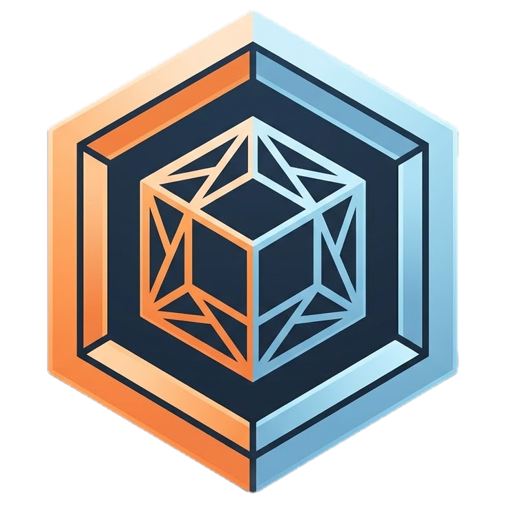

# 📦 STLDepot (STL-Storage Hub)

<p align="center">
  
</p>

<p align="center">
  <strong>Der moderne, blitzschnelle Open-Source 3D-Druck-Katalog für STL- und 3MF-Dateien mit Three.js WebGL-Vorschau, Studio-Beleuchtung, Progressive Lazy Loading und direkter Slicer-Anbindung.</strong>
</p>

<p align="center">
  <a href="#-features"></a>
  <a href="#-features"></a>
  <a href="#-features"></a>
  <a href="#-features"></a>
  <a href="#-installation--schnellstart"></a>
  <a href="https://github.com/Schello805/aiprintstudio"></a>
  <a href="LICENSE"></a>
</p>

---

## 🍎 Begleit-App für den Mac: AIPrintStudio

> [!TIP]
> **Für macOS-Nutzer:** Entdecke auch das Projekt **[AIPrintStudio](https://github.com/Schello805/aiprintstudio)** – die native KI-gestützte Begleit-App für 3D-Druck, Slicer-Steuerung und Filament-Management auf dem Mac von Michael Schellenberger!

---

## 🌟 Überblick

**STLDepot (STL-Storage Hub)** ist deine zentrale, selbst gehostete Schaltzentrale für alle deine 3D-Druck-Modelle. Schluss mit unübersichtlichen Ordnern, kryptischen Dateinamen und fehlenden Vorschaubildern:

* 🖼️ **Foto-Studio-Sockel:** Jedes Modell wird mit ambienter Spotlight-Beleuchtung in Szene gesetzt – selbst pechschwarze STL-Modelle haben hervorragenden Kontrast.
* ⚡ **Progressive Lazy Loading:** Kein langes Warten oder nervige Seitennavigation. Karten werden beim Herunterscrollen flüssig und ressourcenschonend nachgeladen.
* 🖨️ **1-Klick Slicer-Übergabe:** Öffne deine Modelle direkt in **Anycubic Slicer**, **Anycubic Photon**, **Bambu Studio**, **OrcaSlicer**, **PrusaSlicer** oder **UltiMaker Cura**.
* 📏 **Werkstatt-Tools:** Integrierte Millimeter-Bemaßung, interaktive Schnitt-Ebenen (Cross-Section) und druckfertige QR-Etiketten für deine Sortierboxen.

---

## 🚀 Installation & Schnellstart

Wähle die passende Installationsmethode für dein System:

### ⚡ Option 1: Linux One-Liner (Empfohlen für Ubuntu, Debian, Raspberry Pi, Proxmox LXC)

Installiere STLDepot vollautomatisch mit einem einzigen Terminalbefehl. Das Skript richtet Node.js 20 LTS, alle Abhängigkeiten, den Produktions-Build sowie einen **Systemd-Hintergrunddienst** mit Autostart bei jedem Systemstart ein:

```bash
curl -fsSL https://raw.githubusercontent.com/Schello805/STLDepot/main/install.sh | bash
```

Nach der Installation ist STLDepot sofort erreichbar unter:  
👉 **`http://<DEINE-SERVER-IP>:3001`**

#### 🛠️ Nützliche Systemd-Befehle:
Das Installationsskript richtet auch den praktischen CLI-Befehl `stldepot` ein:
```bash
stldepot update     # Aktualisiert STLDepot automatisch auf die neueste GitHub-Version
stldepot logs       # Zeigt die Live-Serverlogs an
stldepot status     # Prüft den Status des Systemd-Dienstes
stldepot restart    # Startet den Server neu
```

---

### 🐳 Option 2: Docker & Docker Compose (NAS, Unraid, Synology, TrueNAS)

Wenn du Docker bevorzugst, starte STLDepot einfach mit Docker Compose:

1. **Repository klonen oder docker-compose.yml herunterladen:**
   ```bash
   git clone https://github.com/Schello805/STLDepot.git
   cd STLDepot
   ```

2. **Container starten:**
   ```bash
   docker compose up -d --build
   ```

3. **Fertig!** Öffne `http://<SERVER-IP>:3001` im Browser.  
   Alle 3D-Dateien und Datenbankeinträge werden dauerhaft im Ordner `./data` gespeichert.

---

### ☁️ Option 3: CapRover One-Click Deployment (PaaS Cloud & VPS)

STLDepot bringt eine fertige `captain-definition` mit:

1. In CapRover unter **Apps** -> **Create New App** erstellen (Name z. B. `stldepot`, Haken bei **Has Persistent Data** setzen).
2. Unter **App Configs** -> **Persistent Directories** den Pfad `/app/data` mit Label `stldepot-data` hinzufügen.
3. Im Reiter **Deployment** das Repository `https://github.com/Schello805/STLDepot` (Branch `main`) hinterlegen und auf **Save & Build** klicken.
4. Unter **HTTP Settings** mit 1-Klick ein kostenloses **Let's Encrypt SSL-Zertifikat** aktivieren.

---

### 💻 Option 4: Manuelle Installation (macOS, Windows, Linux mit Node.js)

**Voraussetzung:** [Node.js](https://nodejs.org/) (Version 18 oder neuer)

```bash
# 1. Klonen
git clone https://github.com/Schello805/STLDepot.git
cd STLDepot

# 2. Abhängigkeiten installieren
npm install
npm run build --prefix client

# 3. Server starten
npm start
```
Die Anwendung läuft nun auf **`http://localhost:3001`**.  
(Für die aktive Entwicklung nutze `npm run dev` mit Hot-Module-Reloading).

---

## 🎯 Hauptfunktionen im Detail

### 1. 🖨️ Direkte Slicer-Integration
Mit nur einem Klick wird das Modell an deinen installierten Slicer übergeben:
- 🔷 **Anycubic Slicer:** Für Kobra 2, Kobra 3 und Anycubic Color Engine Pro (ACE Pro) (`anycubicslicer://`)
- 🧪 **Anycubic Photon Workshop:** Für Resin-/DLP-Drucker wie Photon Mono, M5s und M7 (`photonworkshop://`)
- 🎋 **Bambu Studio:** Für X1, P1 und A1 Serien (`bambustudio://`)
- 🐋 **OrcaSlicer:** Für Voron, Creality, Klipper und Universal (`orcaslicer://`)
- 🔶 **PrusaSlicer:** Für Original Prusa i3, MK4 und Mini (`prusaslicer://`)
- ⚙️ **UltiMaker Cura:** Für klassische FDM-Drucker (`cura://`)

### 2. 🧊 3D-WebGL-Viewer & Pro-Messwerkzeuge
- **Drehen, Zoomen, Schwenken:** Flüssige 3D-Steuerung im Browser auf Desktop, Tablet und Smartphone.
- **Schnitt-Ebene (Cross-Section):** Untersuche innere Strukturen, Wandstärken und Infill entlang der X-, Y- oder Z-Achse.
- **Punkt-zu-Punkt Millimeter-Messung:** Klicke zwei Punkte auf dem Modell an, um den realen Abstand in mm live abzulesen.
- **Multi-Color 3MF Farberkennung:** Liest automatisch die zugewiesenen Filamentfarben aus Bambu Studio- und Anycubic 3MF-Dateien aus.
- **Automatische Bemaßung:** Zeigt Dimensionen ($X \times Y \times Z$ in mm), Volumen in $\text{cm}^3$ und das kalkulierte Filamentgewicht (~PLA g) an.

### 3. 🌐 Web-Importer (MakerWorld, Printables, Thingiverse)
- Füge einfach den Link einer Modellseite (z. B. von *MakerWorld*, *Printables* oder *Thingiverse*) oder eine direkte `.stl`/`.3mf` URL ein.
- STLDepot lädt das Modell, extrahiert Titel, Beschreibung sowie Designer-Infos und speichert das Titelbild automatisch ab.

### 4. 🏷️ Werkstatt-Etiketten & QR-Code Generator
- Erzeuge druckfertige Aufkleber mit Modell-Vorschau, Maßen, Filament-Typ und QR-Code.
- Scanne den Code an deiner Sortierbox mit dem Handy, um sofort das 3D-Modell in der Web-App aufzurufen.

### 5. 🔄 Ordner-Scanner & Multi-Worker Upload
- **Drop & Index:** Neue Dateien im Ordner `data/watch_import` werden automatisch im Hintergrund erfasst.
- **Paralleler Multi-Worker:** Große Sammlungen werden mit 4 parallelen Upload-Workern und Live-Fortschrittsbalken im Header blitzschnell importiert.
- **Baugruppen-Erkennung:** Unterordner können wahlweise als zusammenhängendes mehrteiliges Projekt oder als Einzelkarten importiert werden.

### 6. 🔄 Dynamische Revisionsnummer & Live-Update-Checker
- Der Footer zeigt bei jedem Push eine automatisch hochzählende Revisionsnummer an (z. B. `Rev. r15.b246315`).
- Sobald ein neuer Commit im GitHub-Repository bereitsteht, weist ein pulsierendes Badge im Footer direkt darauf hin.

---

## 📂 Verzeichnisstruktur

```text
STLDepot/
├── client/                     # Frontend (React 19 + Vite + Three.js + Tailwind CSS)
│   ├── src/
│   │   ├── components/         # Modals, Navbar, ModelCard, SlicerModal, 3D Canvas
│   │   ├── utils/              # STL & 3MF Parser, Snapshot- & Farberkennung
│   │   └── App.jsx             # Haupt-App mit Responsive Grid & Lazy Load
├── server/                     # Backend (Node.js + Express)
│   ├── routes/
│   │   ├── models.js           # REST-API für Modelle, Upload & Batch-Operationen
│   │   ├── system.js           # System-Info, Revisionszähler & Update-Checker
│   │   └── webImport.js        # Web-Scraper für MakerWorld/Printables/Thingiverse
│   ├── scanner.js              # Automatischer Ordner-Scanner (chokidar)
│   └── db.js                   # SQLite WAL-Modus Datenbank (better-sqlite3)
├── data/                       # Persistenter Datenspeicher
│   ├── models/                 # Gespeicherte 3D-Dateien (.stl, .3mf)
│   ├── thumbnails/             # Generierte Foto-Vorschauen
│   └── watch_import/           # Hot-Folder für automatischen Import
├── install.sh                  # ⚡ Automatischer Linux One-Liner Installer
├── Dockerfile                  # Multi-Stage Produktions-Image
├── docker-compose.yml          # Container-Setup
├── captain-definition          # CapRover Deployment
└── LICENSE                     # CC BY-NC 4.0 Lizenz
```

---

## 📜 Lizenz & Urheberrecht

Dieses Projekt steht unter der **[Creative Commons Attribution-NonCommercial 4.0 International (CC BY-NC 4.0)](LICENSE)** Lizenz.

- ✅ **Erlaubt:** Kostenfreie private Nutzung, Anpassung und Weitergabe für Maker und 3D-Druck-Begeisterte.
- ❌ **Nicht erlaubt:** Kommerzielle Nutzung oder gewerblicher Weiterverkauf ohne vorherige schriftliche Genehmigung.

**Entwickelt mit ❤️ von [Michael Schellenberger](https://github.com/Schello805)**
